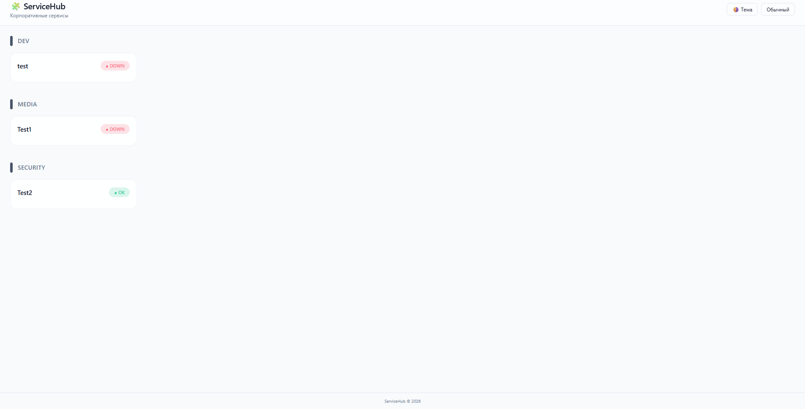
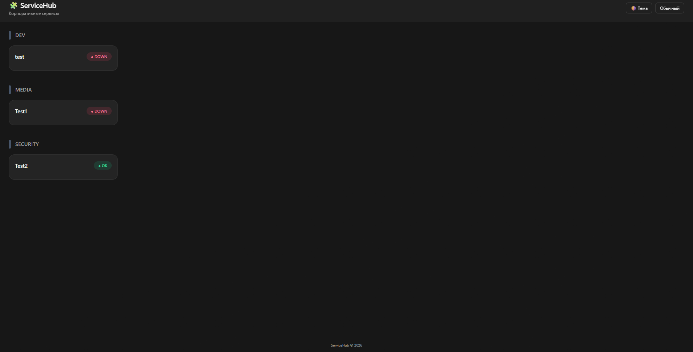

# 🧩 ServiceHub

**ServiceHub** — лёгкая корпоративная панель мониторинга внутренних сервисов.  
Минималистичный UI, поддержка светлой и тёмной темы, drag & drop, веб-админка.

> Flask + SQLite + Tailwind CSS + Docker

---

## ✨ Возможности

- 📁 Группы сервисов
- 🔄 Авто-проверка доступности (OK / WARNING / DOWN)
- 🧲 Drag & Drop порядок карточек (с сохранением)
- 🌓 Светлая и тёмная тема
- 📦 Компактный / обычный режим
- ⚙️ Веб-админка
- 💾 SQLite (без внешних БД)
- 🐳 Готовый Docker-образ

---

## 🖼 Интерфейс

### Светлая тема


### Тёмная тема


---

## 🚀 Быстрый запуск через Docker

```bash
docker compose up -d

http://localhost:5000